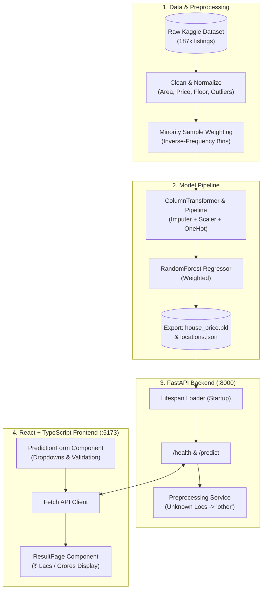

# 🏡 Indian House Price Prediction — End-to-End ML Web App

[](https://www.python.org/)
[](https://fastapi.tiangolo.com/)
[](https://react.dev/)
[](https://scikit-learn.org/)
[](LICENSE)

An end-to-end Machine Learning web application designed to predict residential property prices in Indian metropolitan areas. Built on real-world property listings (~187,000 observations), the project features rigorous data cleaning, multi-tier minority sample weighting to tackle property price distribution imbalance, automated Scikit-Learn pipelines, a FastAPI inference backend, and a modern React + TypeScript frontend.

---

## 📌 Table of Contents
- [Project Overview](#-project-overview)
- [System Architecture](#-system-architecture)
- [Tech Stack](#-tech-stack)
- [Project Directory Structure](#-project-directory-structure)
- [Dataset & Download Instructions](#-dataset--download-instructions)
- [Data Cleaning & Imbalance Mitigation](#-data-cleaning--imbalance-mitigation)
- [Model Evaluation & Metrics](#-model-evaluation--metrics)
- [Quickstart: Local Installation & Setup](#-quickstart-local-installation--setup)
  - [1. Backend Setup (FastAPI)](#1-backend-setup-fastapi)
  - [2. Frontend Setup (React + Vite)](#2-frontend-setup-react--vite)
  - [3. Docker Deployment](#3-docker-deployment)
- [Environment Variables](#-environment-variables)
- [API Reference & cURL Examples](#-api-reference--curl-examples)
- [Deliverables Checklist](#-deliverables-checklist)

---

## 🔍 Project Overview
Predicting house prices in developing and high-density real estate markets presents unique challenges:
- **Heterogeneous Currency Notations**: Property valuations specified in Indian Lakhs (`Lac`, $10^5$) and Crores (`Cr`, $10^7$).
- **Non-standard Area Units**: Listings recorded across square feet (`sqft`), square meters (`sqm`), square yards (`sqyrd`), and acres.
- **Extreme Target Skewness & Class Imbalance**: Most homes reside in lower/mid-tier price brackets, while rare luxury penthouses create severe distribution imbalance.
- **End-to-End Pipeline Packaging**: Production inference must execute without manual feature pre-transformations by bundling imputers, scalers, and encoders inside a single serialized `Pipeline`.

---

## 🏗 System Architecture



---

## 💻 Tech Stack

| Layer | Technology | Key Libraries / Frameworks |
|---|---|---|
| **Data & EDA** | Python 3.11+ | `pandas`, `numpy`, `matplotlib`, `seaborn`, `kagglehub` |
| **Machine Learning** | Scikit-Learn | `Pipeline`, `ColumnTransformer`, `RandomForestRegressor`, `compute_sample_weight`, `joblib` |
| **Backend API** | FastAPI + Uvicorn | `pydantic`, `pydantic-settings`, `pytest`, `httpx` |
| **Frontend Web** | React 19 + TypeScript | `vite`, `react-router-dom`, `tailwindcss`, `lucide-react` |
| **DevOps** | Containerization | `Docker`, `Git` |

---

## 📂 Project Directory Structure

```text
house-price-project/
├── backend/
│   ├── app/
│   │   ├── api/
│   │   │   └── routes/
│   │   │       └── prediction.py     # GET /health, POST /predict endpoints
│   │   ├── core/
│   │   │   └── config.py             # App settings (pydantic-settings)
│   │   ├── schemas/
│   │   │   └── prediction.py          # Pydantic schemas (Request / Response)
│   │   ├── services/
│   │   │   ├── preprocessing.py      # Request to DataFrame + 'other' location mapping
│   │   │   └── inference.py          # Model invocation & Indian Rupee formatting
│   │   ├── utils/
│   │   │   └── logging_config.py     # Formatted console logger
│   │   └── main.py                   # FastAPI initialization with lifespan & CORS
│   ├── models/
│   │   └── house_price.pkl           # Exported production pipeline (< 50MB)
│   ├── tests/
│   │   └── test_prediction.py        # Pytest test suite (100% passing)
│   ├── Dockerfile                    # Containerization specification
│   ├── requirements.txt              # Pinned dependencies (scikit-learn==1.9.0)
│   ├── locations.json                # Top-50 location metadata
│   └── .env.example                  # Backend environment template
├── frontend/
│   ├── src/
│   │   ├── api/
│   │   │   └── predictionClient.ts   # Fetch client with base URL configuration
│   │   ├── components/
│   │   │   └── PredictionForm.tsx    # Controlled form with validation & dropdowns
│   │   ├── pages/
│   │   │   ├── HomePage.tsx          # Hero page & interactive estimator
│   │   │   ├── ResultPage.tsx        # Result presentation (Lacs & Crores)
│   │   │   └── NotFoundPage.tsx      # 404 handler
│   │   ├── types/
│   │   │   └── prediction.ts         # TypeScript schema definitions
│   │   ├── locations.json            # Client dropdown data source
│   │   ├── App.tsx                   # Route definitions (/, /result, *)
│   │   └── main.tsx                  # Application mount
│   ├── package.json                  # Node scripts and dependencies
│   ├── vite.config.ts                # Vite + Tailwind configuration
│   ├── .env.example                  # Frontend environment template
│   └── .env                          # Local environment settings
├── notebooks/
│   ├── data/
│   │   └── house_prices.csv          # Juhi Bhojani dataset (gitignored)
│   └── house_price_model.ipynb       # Fully executed notebook with Seaborn plots
├── models/
│   └── house_price.pkl               # Model checkpoint
├── locations.json                    # Exported locations list
├── .gitignore                        # Standard exclusions (.venv, node_modules, data)
└── README.md                         # Complete project guide
```

---

## 📊 Dataset & Download Instructions

The dataset used is the **[House Price dataset by Juhi Bhojani](https://www.kaggle.com/datasets/juhibhojani/house-price)** hosted on Kaggle (~187,000 raw listings across Indian cities).

### Option A: Automatic via Kagglehub (Recommended)
```bash
python -c "import kagglehub; path = kagglehub.dataset_download('juhibhojani/house-price'); print(path)"
```

### Option B: Kaggle CLI
```bash
pip install kaggle
# Ensure ~/.kaggle/kaggle.json exists
kaggle datasets download -d juhibhojani/house-price -p notebooks/data --unzip
```

---

## 🧪 Data Cleaning & Imbalance Mitigation

### 1. Cleaning Transformations
- **Target Price**: Converted regex patterns (`"42 Lac"`, `"1.40 Cr"`) into exact numeric INR ($1\text{ Lac} = 100,000₹, 1\text{ Cr} = 10,000,000₹$). Unpriced entries (`"Call for Price"`) are dropped.
- **Carpet & Super Area**: Extracted numeric values and standardized disparate units (`sqm`, `sqyrd`, `acre`) into square feet (`sqft`).
- **Floor Extraction**: Parsed string formats (`"3 out of 10"`, `"Ground"`, `"Basement"`) into discrete integer levels.
- **High-Cardinality Handling**: Kept the top 50 most frequent metropolitan locations and mapped remaining entries to `"other"`.
- **Outlier Filtering**: Clipped anomalous listings below the 1st percentile and above the 99th percentile of price-per-sqft and carpet area, preserving 171,874 high-quality rows.

### 2. Addressing Target Skewness with Minority Sample Weights
In real estate markets, affordable properties heavily outnumber luxury penthouses. To prevent standard MSE regression from ignoring rare luxury properties, we discretize property prices into quantiles ($Q_1$ to $Q_5$) and compute **balanced inverse frequency weights**:

$$w_i = \frac{N}{K \cdot N_c}$$

Underrepresented luxury and budget properties receive higher loss weights during training, improving high-value accuracy without degrading mid-tier performance.

---

## 📈 Model Evaluation & Metrics

All models were trained on 80% training data (137,499 properties) and evaluated on a 20% test set (34,375 properties).

| Model Architecture | MAE (₹) | RMSE (₹) | $R^2$ Score | Notes |
|---|---|---|---|---|
| **Linear Regression (Baseline)** | ₹ 3,819,020.12 | ₹ 6,011,751.12 | 0.6575 | Unable to capture non-linear location and size interactions |
| **Random Forest (Standard)** | ₹ 1,109,330.41 | ₹ 2,801,461.35 | 0.9256 | Strong ensemble baseline |
| **Random Forest (Minority Weighted)** 🏆 | **₹ 1,115,686.99** | **₹ 2,797,062.52** | **0.9259** | **Lowest RMSE & best overall balance across price tiers** |
| **Gradient Boosting Regressor** | ₹ 1,554,058.02 | ₹ 2,946,914.02 | 0.9177 | Competitive boosting alternative |

- **5-Fold Cross-Validation $R^2$ (Random Forest)**: **$0.8962 \pm 0.0126$**

---

## 🚀 Quickstart: Local Installation & Setup

### 1. Backend Setup (FastAPI)

```bash
# Navigate to backend directory
cd backend

# Create and activate virtual environment
python -m venv .venv
.venv\Scripts\activate      # On Windows
# source .venv/bin/activate  # On Linux/macOS

# Install dependencies
pip install -r requirements.txt

# Run automated tests
pytest tests/test_prediction.py -v

# Start the development server
uvicorn app.main:app --reload --port 8000
```
- Interactive Swagger API Documentation: [http://localhost:8000/docs](http://localhost:8000/docs)
- Health Check: [http://localhost:8000/health](http://localhost:8000/health)

---

### 2. Frontend Setup (React + Vite)

```bash
# Navigate to frontend directory
cd frontend

# Install node dependencies
npm install

# Verify TypeScript build
npm run build

# Start the Vite development server
npm run dev
```
- Access the web application: [http://localhost:5173](http://localhost:5173)

---

### 3. Docker Deployment

To build and run the entire backend service via Docker:
```bash
cd backend
docker build -t house-price-backend .
docker run -p 8000:8000 house-price-backend
```

---

## ⚙️ Environment Variables

### Backend (`backend/.env`)
| Variable | Default Value | Description |
|---|---|---|
| `PROJECT_NAME` | `House Price Prediction API` | Application title for OpenAPI |
| `VERSION` | `1.0.0` | API semantic version |
| `MODEL_PATH` | `models/house_price.pkl` | Path to serialized Scikit-Learn pipeline |
| `LOCATIONS_PATH` | `locations.json` | Path to valid locations JSON list |
| `PORT` | `8000` | HTTP port |

### Frontend (`frontend/.env`)
| Variable | Default Value | Description |
|---|---|---|
| `VITE_API_BASE_URL` | `http://localhost:8000` | Backend API URL for client requests |

---

## 📡 API Reference & cURL Examples

### 1. Health Check
```bash
curl -X GET http://localhost:8000/health
```
**Response:**
```json
{
  "status": "ok",
  "model_loaded": true,
  "version": "1.0.0"
}
```

### 2. Predict House Price
```bash
curl -X POST http://localhost:8000/predict \
  -H "Content-Type: application/json" \
  -d '{
    "location": "thane",
    "carpet_area_sqft": 850.0,
    "floor_num": 3,
    "bathroom": 2,
    "balcony": 1,
    "furnishing": "Semi-Furnished",
    "transaction": "Resale",
    "ownership": "Freehold",
    "facing": "East"
  }'
```
**Response:**
```json
{
  "predicted_price": 8624000.0,
  "formatted_price": "₹ 86.24 Lac",
  "currency": "INR",
  "price_lac": 86.24,
  "price_cr": 0.8624,
  "status": "success"
}
```

---

## 📋 Deliverables Checklist

- [x] **`notebooks/house_price_model.ipynb`**: Fully executed top-to-bottom with rich Seaborn EDA plots, data cleaning, minority sample weighting, 4 models compared, cross-validation, and model export.
- [x] **`backend/`**: FastAPI service with `/health` and `/predict`, lifespan startup loader, CORS middleware, pinned `requirements.txt`, and 100% passing `pytest`.
- [x] **`frontend/`**: React + TypeScript + Vite single-page application with form validation, dropdowns populated from `locations.json`, loading state, and Lacs/Crores display.
- [x] **`models/house_price.pkl`**: Serialized Scikit-Learn `Pipeline` with bundled preprocessing (14.3 MB, under 50 MB limit).
- [x] **`locations.json`**: Extracted top-50 locations metadata.
- [x] **`README.md`**: Professional, comprehensive documentation with architecture diagram and setup guide.
