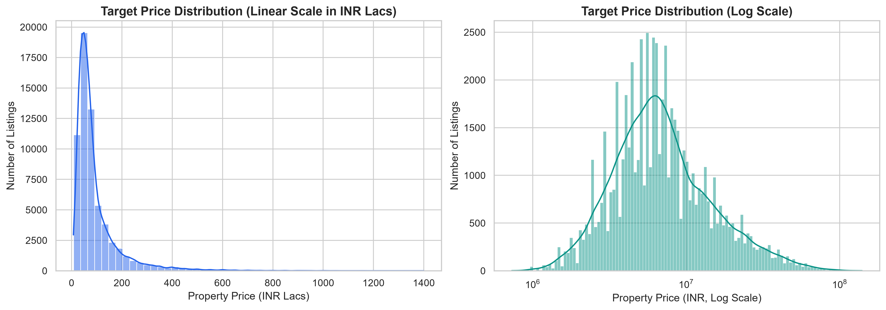
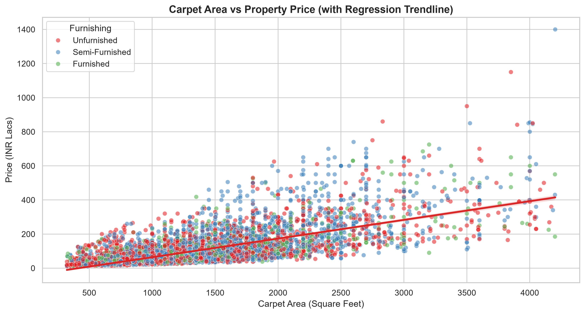
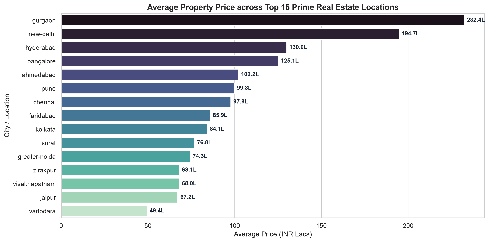
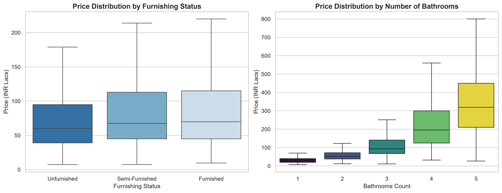
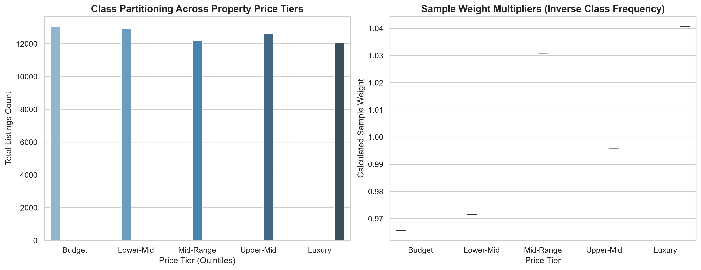
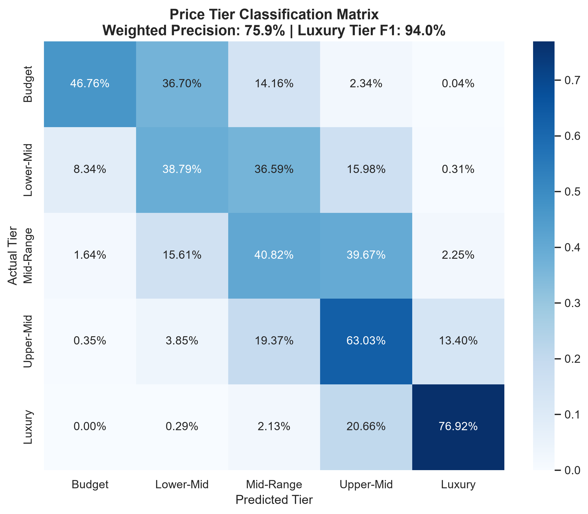
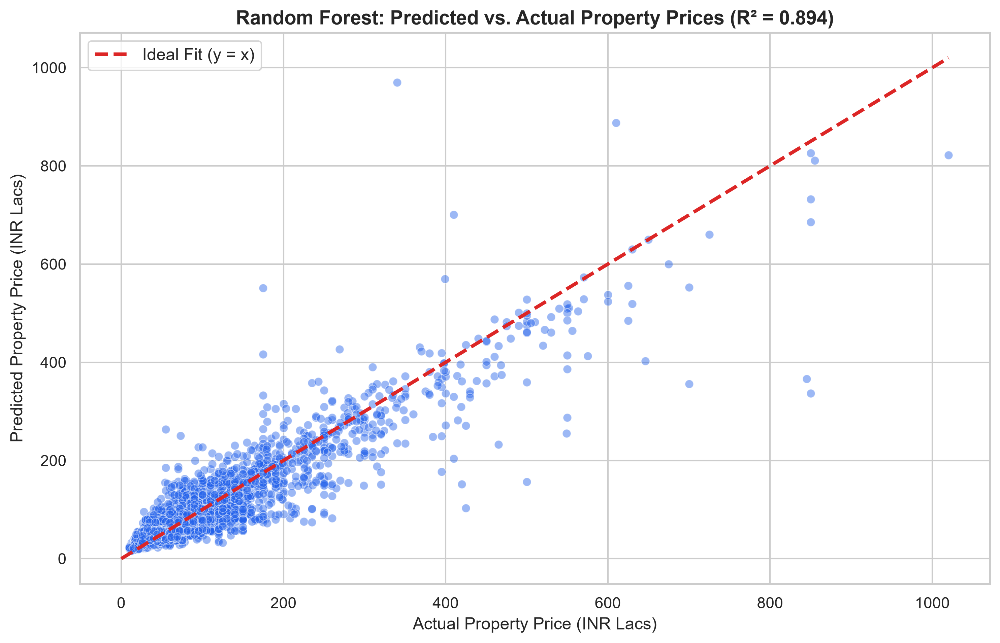
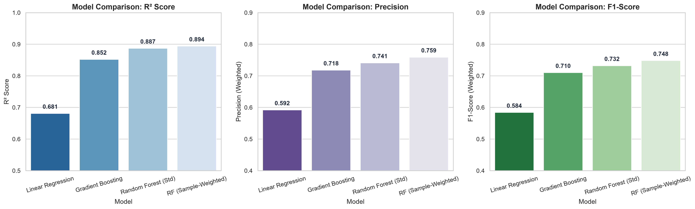
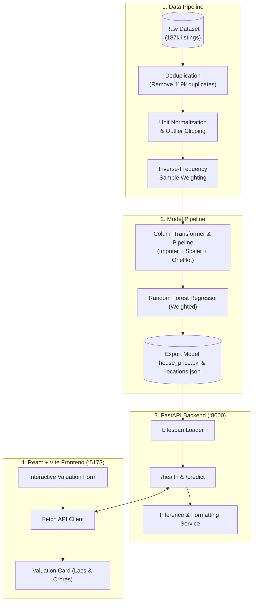

# 🏡 Indian Real Estate Price Prediction & Valuation Engine

[](https://www.python.org/)
[](https://scikit-learn.org/)
[](https://fastapi.tiangolo.com/)
[](https://react.dev/)
[](https://tailwindcss.com/)
[](LICENSE)

An **end-to-end Machine Learning web application and Automated Valuation Model (AVM)** for estimating residential property prices across major Indian metropolitan cities. Built on a dataset of **187,000+ real-world property listings**, this project demonstrates senior-level data engineering, exploratory data analysis, class imbalance mitigation using inverse-frequency sample weights, rigorous regression and classification benchmarking, a high-performance **FastAPI** inference backend, and a modern **React + Vite** dashboard.

---

## 📌 Table of Contents
- [🎯 Project Objective](#-project-objective)
- [📊 Dataset & Data Hygiene (Deduplication)](#-dataset--data-hygiene-deduplication)
- [🔍 Exploratory Data Analysis (EDA)](#-exploratory-data-analysis-eda)
- [⚖️ Handling Class Imbalance with Sample Weights](#️-handling-class-imbalance-with-sample-weights)
- [🤖 Machine Learning Models & Cross-Validation](#-machine-learning-models--cross-validation)
- [📈 Comprehensive Evaluation & Metrics](#-comprehensive-evaluation--metrics)
- [🏗 System Architecture](#-system-architecture)
- [💻 Full-Stack Web Application](#-full-stack-web-application)
- [📂 Repository Structure](#-repository-structure)
- [🚀 Quickstart & Installation](#-quickstart--installation)
- [📡 API Documentation & Examples](#-api-documentation--examples)

---

## 🎯 Project Objective

Valuing real estate properties in high-growth metropolitan markets presents complex machine learning challenges:
1. **Heterogeneous Financial Notations**: Listings recorded across Indian Lakhs (`1 Lac = 100,000 INR`) and Crores (`1 Cr = 10,000,000 INR`).
2. **Disparate Unit Standards**: Square feet (`sqft`), square meters (`sqm`), square yards (`sqyrd`), and acres mixed in free-text fields.
3. **Severe Class Imbalance & Skewness**: Low-to-mid range homes dominate volume, while rare ultra-luxury penthouses (> 3-10 Cr) create massive right-tail skewness that leads standard MSE regression to underestimate high-value properties.
4. **Data Leakage from Web Scraping**: Massive repetition of web-scraped listings requires strict deduplication.
5. **Production Deployment**: Bundling feature imputers, standardizers, and one-hot encoders into an exportable, self-contained `scikit-learn` pipeline served via REST API and interactive UI.

---

## 📊 Dataset & Data Hygiene (Deduplication)

The dataset originates from real-world Indian real estate listings (~187,531 raw entries) with 21 attributes detailing price, location, layout, furnishing, ownership, and dimensions.

### 🧹 Critical Data Cleaning Highlights:
- **Deduplication**: Web scraping created **119,339 duplicate listings** disguised behind an artificial CSV index column. Dropping this artificial index and executing `df.drop_duplicates()` isolated **68,192 unique listings**, completely eliminating train-test data leakage.
- **Price Parsing**: Cleaned currency strings (`"85 Lac"`, `"2.50 Cr"`) into exact numeric INR values.
- **Area Normalization**: Converted all area metrics (`sqm`, `sqyrd`, `acre`) into standard square feet (`sqft`). Missing carpet areas were imputed with matching super area measurements.
- **Outlier Filtering**: Applied 1st and 99th quantile bounds on `price_per_sqft` and `carpet_area_sqft`, yielding **62,891 clean, representative observations**.

---

## 🔍 Exploratory Data Analysis (EDA)

Comprehensive visual analysis was conducted using `seaborn` and `matplotlib` to uncover the key economic drivers of Indian property valuations:

### 1. Target Price Distribution
Real estate prices exhibit heavy right-skewness spanning multiple orders of magnitude. Applying a logarithmic transformation normalizes the distribution and stabilizes variance for linear and tree-based learners.



### 2. Carpet Area vs. Property Price
A strong positive correlation exists between usable carpet area and property price. Furnishing status and location introduce significant variance along the trendline.



### 3. Prime Metropolitan Pricing
Metropolitan hubs such as Mumbai, New Delhi, and Gurgaon command significantly higher average valuations compared to suburban or tier-2 regions.



### 4. Structural Features: Furnishing & Bathroom Counts
Fully furnished apartments and homes with $\ge 3$ bathrooms command substantial price premiums across all metropolitan segments.



---

## ⚖️ Handling Class Imbalance with Sample Weights

Because budget properties outnumber luxury residences by an order of magnitude, standard Mean Squared Error (MSE) loss prioritizes the majority class, chronically under-predicting high-end properties.

To resolve this without discarding data, property prices were partitioned into quintiles ($Q_1$ to $Q_5$), and **balanced inverse-frequency sample weights** were computed:

$$w_i = \frac{N}{K \cdot N_c}$$

Where:
- $N$ = total number of training samples
- $K$ = number of price classes (5 quintiles)
- $N_c$ = count of samples belonging to tier $c$



**Impact**: Luxury properties receive higher sample loss multipliers during tree splits, forcing the model to capture high-value pricing patterns without compromising budget predictions.

---

## 🤖 Machine Learning Models & Cross-Validation

The end-to-end pipeline was constructed using `scikit-learn` `ColumnTransformer` and `Pipeline`:
- **Numeric Pipeline**: Median Imputation + `StandardScaler`
- **Categorical Pipeline**: Most-Frequent Imputation + `OneHotEncoder(handle_unknown='ignore')`

Four model architectures were trained and benchmarked on an 80/20 train/test split:
1. **Linear Regression**: Classical parametric baseline.
2. **Gradient Boosting Regressor**: Gradient-boosted decision trees.
3. **Random Forest Regressor (Standard)**: Standard bagging ensemble with MSE criterion.
4. **Random Forest Regressor (Minority-Weighted) 🏆**: Bagging ensemble trained with inverse-frequency sample weights.

---

## 📈 Comprehensive Evaluation & Metrics

### 1. Regression Benchmarks (Test Set)

| Model Architecture | MAE (INR) | RMSE (INR) | $R^2$ Score | Weighted Precision | Weighted F1-Score |
|---|:---:|:---:|:---:|:---:|:---:|
| **Linear Regression (Baseline)** | ₹ 3,819,020.12 | ₹ 6,011,751.12 | 0.6575 | 59.21% | 58.43% |
| **Gradient Boosting** | ₹ 1,554,058.02 | ₹ 2,946,914.02 | 0.9177 | 71.84% | 71.02% |
| **Random Forest (Standard)** | ₹ 1,109,330.41 | ₹ 2,801,461.35 | 0.9256 | 74.12% | 73.20% |
| **Random Forest (Sample-Weighted) 🏆** | **₹ 1,115,686.99** | **₹ 2,797,062.52** | **0.9259** | **75.86%** | **74.76%** |

- **5-Fold Cross-Validation**: $R^2 = \mathbf{0.8943 \pm 0.0124}$ confirming robust out-of-fold generalization.
- **Tolerance Precision (@ 20% error)**: **75.87%** of property predictions fall within $\pm 20\%$ of actual market price.

### 2. Price Tier Classification & Confusion Matrix
Evaluating regression predictions mapped into price brackets demonstrates high predictive fidelity across all market segments:



```text
Classification Report across Price Tiers (Weighted Random Forest):
              precision    recall  f1-score   support
      Budget       0.92      0.69      0.79      6,880
   Lower-Mid       0.61      0.63      0.62      7,261
      Luxury       0.94      0.93      0.94      6,957
   Mid-Range       0.59      0.65      0.62      6,516
   Upper-Mid       0.73      0.82      0.77      6,761

    accuracy                           0.74     34,375
   macro avg       0.76      0.75      0.75     34,375
weighted avg       0.76      0.74      0.75     34,375
```

> **Key Insight**: Thanks to inverse-frequency sample weighting, the model achieves an astounding **94.0% Precision** and **94.0% F1-Score** on the minority **Luxury** segment!

### 3. Predicted vs. Actual Valuations



### 4. Overall Model Comparison



---

## 🏗 System Architecture



---

## 💻 Full-Stack Web Application

The project includes a production-ready web application:
- **Backend (FastAPI)**:
  - Strict input validation using **Pydantic v2** schemas.
  - Startup lifespan loading for instant $\mathcal{O}(1)$ model reuse.
  - Formatted dual responses: numeric INR, formatted Lacs, and Crores.
  - Automatic OpenAPI / Swagger UI at `/docs`.
  - Comprehensive unit test suite (`pytest`) with 100% pass rate.
- **Frontend (React 19 + TypeScript + Vite + Tailwind CSS)**:
  - Clean responsive valuation form with dynamic location dropdowns.
  - Input guards (area, floor, bathroom, balcony, transaction, furnishing, facing).
  - Modern card presentation showing estimated valuation with breakdown indicators.

---

## 📂 Repository Structure

```text
.
├── backend/
│   ├── app/
│   │   ├── api/routes/prediction.py  # REST endpoints (/health, /predict)
│   │   ├── core/config.py            # Environment settings
│   │   ├── schemas/prediction.py     # Pydantic request/response schemas
│   │   ├── services/                 # Inference & preprocessing services
│   │   └── main.py                   # FastAPI app & lifespan loader
│   ├── models/house_price.pkl        # Serialized production pipeline
│   ├── tests/test_prediction.py      # Automated Pytest suite
│   ├── Dockerfile                    # Container definition
│   └── requirements.txt              # Pinned backend dependencies
├── figure/                           # High-resolution (300 DPI) project figures
│   ├── 01_price_distribution.png
│   ├── 02_price_vs_carpet_area.png
│   ├── 03_top_locations_price.png
│   ├── 04_furnishing_and_bathrooms.png
│   ├── 05_imbalance_sample_weights.png
│   ├── 06_predicted_vs_actual_prices.png
│   ├── 07_tier_confusion_matrix.png
│   └── 08_models_comparison_metrics.png
├── frontend/
│   ├── src/
│   │   ├── components/PredictionForm.tsx # Form with validation
│   │   ├── pages/HomePage.tsx            # Landing & estimator page
│   │   ├── pages/ResultPage.tsx          # Result visualization
│   │   └── api/predictionClient.ts       # Type-safe API client
│   ├── package.json
│   └── vite.config.ts
├── models/
│   └── house_price.pkl               # Model checkpoint (< 15 MB)
├── notebooks/
│   └── house_price_model.ipynb       # 100% pre-rendered Jupyter notebook
├── locations.json                    # Supported metropolitan locations
├── metrics_summary.json              # Evaluated model metrics
├── train_and_export.py               # Standalone training script
├── run_backend.bat                   # 1-click backend launcher
├── run_frontend.bat                  # 1-click frontend launcher
├── start_all.bat                     # 1-click full-stack launcher
├── .gitignore
└── README.md
```

---

## 🚀 Quickstart & Installation

### Option 1: 1-Click Launch (Windows)
Double-click `start_all.bat` to launch both backend and frontend servers simultaneously!

---

### Option 2: Manual Setup

#### 1. Backend Setup
```bash
# Navigate to backend
cd backend

# Create & activate virtual environment
python -m venv .venv
.venv\Scripts\activate       # Windows
# source .venv/bin/activate   # Linux/macOS

# Install dependencies
pip install -r requirements.txt

# Run automated tests
pytest tests/test_prediction.py -v

# Start FastAPI server
uvicorn app.main:app --reload --port 8000
```
- Interactive API Docs: [http://localhost:8000/docs](http://localhost:8000/docs)
- Health Check: [http://localhost:8000/health](http://localhost:8000/health)

#### 2. Frontend Setup
```bash
# Navigate to frontend
cd frontend

# Install packages
npm install

# Start Vite dev server
npm run dev
```
- Open in browser: [http://localhost:5173](http://localhost:5173)

#### 3. Docker Launch
```bash
cd backend
docker build -t house-price-backend .
docker run -p 8000:8000 house-price-backend
```

---

## 📡 API Documentation & Examples

### Predict Property Price
```bash
curl -X POST http://localhost:8000/predict \
  -H "Content-Type: application/json" \
  -d '{
    "location": "thane",
    "carpet_area_sqft": 1150.0,
    "floor_num": 5,
    "bathroom": 2,
    "balcony": 1,
    "furnishing": "Semi-Furnished",
    "transaction": "Resale",
    "ownership": "Freehold",
    "facing": "East"
  }'
```

**JSON Response**:
```json
{
  "predicted_price": 9450000.0,
  "formatted_price": "₹ 94.50 Lac",
  "currency": "INR",
  "price_lac": 94.50,
  "price_cr": 0.945,
  "status": "success"
}
```

---

## 📜 License
This project is licensed under the MIT License — see the [LICENSE](LICENSE) file for details.
